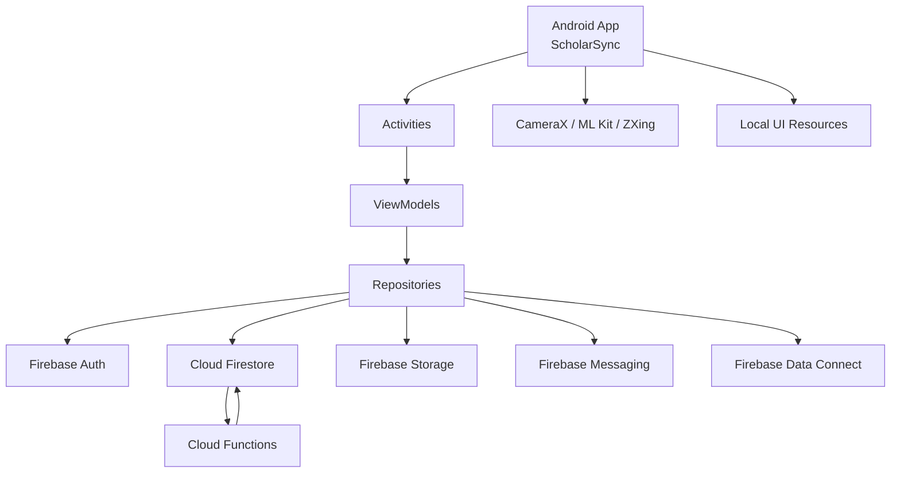

<h1 align="center">ScholarSync 🎓</h1>
<p align="center">
  A complete Android institute management app for admins, teachers, parents, and managers.
</p>

<p align="center">
  
  
  
  
</p>

<p align="center">
  <b>📚 Smart academic workflows</b> •
  <b>🔔 Real-time notifications</b> •
  <b>📊 Role-based dashboards</b> •
  <b>📱 Launch-ready Android app</b>
</p>

---

## ✨ Overview

ScholarSync is a role-based Android application built for educational institutes to centralize academics, administration, communication, and reporting in one mobile platform.

The repository includes:

- 📱 Android app source
- 🔐 Firebase Authentication integration
- ☁️ Firestore, Storage, Messaging, and Analytics setup
- ⚙️ Cloud Functions for backend automation
- 🧩 Firebase Data Connect schema and connector assets
- 🛠️ Build, rules, and deployment configuration needed to continue development

The app is organized around four primary roles:

- 🛡️ Admin
- 👩‍🏫 Teacher
- 👨‍👩‍👧 Parent
- 📋 Manager

Each role gets its own dashboard and focused workflow set.

## 🌟 Key Features

- 🎯 Role-based dashboard experience
- 🔐 Email/password authentication with Firebase
- 🧾 Student, user, subject, and batch management
- 📅 Class schedule and weekly timetable workflows
- ✅ Attendance tracking and reporting
- 📝 Homework, assignment, grading, and score entry flows
- 📈 Results, performance, and syllabus progress tracking
- 💰 Fee structure and payment status management
- 📢 Announcements and institute communication tools
- 💬 In-app messaging and conversations
- 📚 Learning resource management
- 📷 QR and barcode scanning support
- ☁️ Backend cleanup automations with Cloud Functions

## 👥 Feature Matrix

| Feature | Admin | Teacher | Parent | Manager |
|---|---|---|---|---|
| Role dashboard | ✅ | ✅ | ✅ | ✅ |
| Authentication | ✅ | ✅ | ✅ | ✅ |
| User management | ✅ | ❌ | ❌ | ❌ |
| Student management | ✅ | ❌ | ❌ | ❌ |
| Subject management | ✅ | ❌ | ❌ | ❌ |
| Batch and enrollment management | ✅ | ❌ | ❌ | ❌ |
| Class schedule management | ✅ | ✅ View | ❌ | ❌ |
| Weekly timetable setup | ✅ | ❌ | ❌ | ❌ |
| Attendance marking | ❌ | ✅ | ❌ | ❌ |
| Attendance viewing | ✅ Reports | ❌ | ✅ | ❌ |
| Homework management | ❌ | ✅ | ❌ | ❌ |
| Homework viewing | ❌ | ❌ | ✅ | ❌ |
| Exam management | ✅ | ✅ Score Entry | ✅ Results | ❌ |
| Fee structure management | ✅ | ❌ | ❌ | ❌ |
| Fee status tracking | ✅ | ❌ | ✅ | ❌ |
| Announcements | ✅ | ✅ | ✅ View | ❌ |
| Messaging | ✅ | ✅ | ✅ | ❌ |
| Learning resources | ✅ Manage | ✅ Manage | ✅ View | ❌ |
| Syllabus progress | ✅ Reports | ✅ Update | ✅ View | ❌ |
| Analytics and reports | ✅ | ❌ | ❌ | ❌ |
| Global search | ✅ | ❌ | ❌ | ❌ |
| QR scanning | ❌ | ❌ | ❌ | ✅ |

## 🧭 Role Modules

### 🛡️ Admin

- Manage users
- Manage students
- Manage subjects
- Manage batches and enrollments
- Manage class schedules
- Configure weekly timetables
- Manage fee structures
- Track fee payment status
- Manage exams and results
- Manage announcements
- Track syllabus status
- Access analytics and institute reports
- Customize dashboard layout
- Use global search

### 👩‍🏫 Teacher

- Access teacher dashboard
- Mark attendance
- Manage homework and assignments
- Grade student submissions
- Enter exam scores
- Update syllabus progress
- Manage resources
- View schedules
- Publish announcements
- Use messaging features

### 👨‍👩‍👧 Parent

- Access parent dashboard
- View student profile
- Monitor attendance
- View homework and assignments
- Track fees and payment history
- View syllabus progress
- Check performance and results
- Access learning resources
- Read announcements and notifications
- Use messaging features

### 📋 Manager

- Access manager dashboard
- Use QR scanning workflow

## 🏗️ Architecture

ScholarSync follows a layered Android architecture with separate UI, state, and data access responsibilities.

- `activities/` for screens and user flows
- `viewmodels/` for state handling and screen logic
- `repositories/` for data orchestration
- `models/` for app domain models
- `auth/` for authentication logic
- `utils/` and `dialogs/` for shared components

This is a classic Android XML + Activity based application using ViewBinding, not a Jetpack Compose app.

## 🗺️ System Architecture



## 🧰 Tech Stack

### Mobile

- Kotlin
- Java
- Android SDK
- Gradle
- ViewBinding
- Android Lifecycle
- ViewModel
- LiveData
- Navigation Components
- RecyclerView
- ConstraintLayout

### Data and Persistence

- Firebase Firestore
- Firebase Data Connect
- Firebase Storage
- Room setup present in project configuration

### Backend and Services

- Firebase Authentication
- Firebase Cloud Messaging
- Firebase Analytics
- Firebase Cloud Functions
- Firebase Admin SDK

### Scanning and Utilities

- CameraX
- Google ML Kit Barcode Scanning
- ZXing
- Apache POI
- Kotlin Coroutines
- Kotlin Serialization
- Gson

## 📂 Project Structure

```text
EduSoul/
|-- app/                    Android application module
|-- functions/              Firebase Cloud Functions in TypeScript
|-- dataconnect/            Firebase Data Connect schema and connector files
|-- gradle/                 Gradle wrapper and version catalog
|-- firebase.json           Firebase project configuration
|-- firestore.rules         Firestore security rules
|-- firestore.indexes.json  Firestore indexes
|-- storage.rules           Storage rules
|-- database.rules          Database rules
```

## 🔥 Firebase Setup Included

This repository already contains project files for:

- Firestore
- Cloud Functions
- Cloud Storage
- Firebase Messaging
- Firebase Data Connect

Current configuration references include:

- Firestore location: `asia-south1`
- Data Connect generated connector reference: `us-central1`

The Functions module currently includes cascade cleanup logic for entities such as:

- batches
- students
- subjects

This helps keep related Firestore collections consistent after delete operations.

## 📱 Android Capabilities

The manifest currently includes support for:

- 📷 Camera access
- 🔔 Notifications
- 🎤 Microphone access
- 📆 Calendar read/write
- 📁 Legacy storage access for older Android versions

These support QR scanning, alerts, attachment-related workflows, and schedule-based features.

## 🚀 Getting Started

### 1. Clone the repository

```bash
git clone https://github.com/Aquaa19/EduSoul.git
cd EduSoul
```

### 2. Open in Android Studio

- Open the project root
- Let Gradle sync finish
- Confirm your Android SDK is installed
- Ensure `local.properties` points to your SDK path

### 3. Configure Firebase

- Keep a valid `app/google-services.json` in place
- Use a Firebase project configured for Auth, Firestore, Storage, Messaging, and Functions

### 4. Install Cloud Functions dependencies

```bash
cd functions
npm install
npm run build
```

## 🛠️ Build Instructions

### Android app

From Android Studio:

- Sync Gradle
- Select a device or emulator
- Run the app

From command line:

```bash
./gradlew assembleDebug
```

Windows PowerShell:

```powershell
.\gradlew.bat assembleDebug
```

## ☁️ Firebase Emulator / Deployment

### Run Cloud Functions locally

```bash
cd functions
npm run serve
```

### Start Firebase emulators

```bash
firebase emulators:start
```

### Deploy only functions

```bash
cd functions
npm install
npm run build
firebase deploy --only functions
```

### Deploy Firebase project resources

```bash
firebase deploy
```

## ⚠️ Important Notes

- `local.properties` is machine-specific and should not be committed
- `functions/node_modules` and Android build outputs should not be committed
- `functions/lib` is generated build output
- `app/google-services.json` is required for Firebase-enabled builds
- If the app is later connected to Google Play, the release keystore must be backed up separately

## 📌 Repository Status

ScholarSync is structured as a full-stack mobile project repository containing:

- the Android client
- backend support files
- Firebase rules and indexes
- Cloud Functions source
- Data Connect assets

This makes the repo suitable for continued development, restoration on a new machine, and future deployment work.

## 📜 License

No license file has been added yet. If you plan to distribute or open-source the project publicly, add an explicit license before release.

---

<p align="center">
  Built for modern institute workflows with <b>Android</b>, <b>Firebase</b>, and a product-first approach. 🚀
</p>
